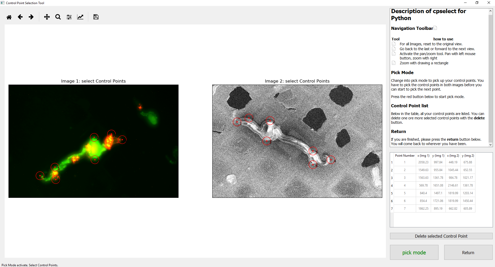

# correlateim

`correlateim` is a package for aligning images.

The user interactively selects matching point pairs, then the transformation matrix is calculated and an image overlay result is returned.

The interactive GUI module is adapted from [cpselect](https://github.com/adal02/cpselect), a Python port of the MATLAB cpselect functionality.

## Quickstart
If you have an existing installation:

* Remember to activate your environment first, eg: `conda activate correlateim`
* you can see how to use the two methods available using `--help`
    ```
    correlateim --help
    correlateim-from-file --help
    ```

### 1. Aligning images with matched control points
```
correlateim path/to/fluorescence_image.tif path/to/fibsem_image.tif my-output-filename.png
```

### 2. Using an existing image transformation
You may like to use an existing image transformation in cases where you are adjusting the image brightness/contrast for display purposes.

```
correlateim-from-file path/to/transformation.npy path/to/fluorescence_image.tif path/to/fibsem_image.tif my-output-filename.png
```

## Installation

### 1. Activate your virtual environment

We recommend using python virtual environments.
We use conda, included in the [Anaconda python distribution (download here)](https://www.anaconda.com/distribution/).

First, make and activate a new environment:

```
conda create -n correlateim pip python=3.6
conda activate correlateim
```

### 2. Download and install the latest release
Then download the latest wheel file from the release page at: https://github.com/DeMarcoLab/correlateim/releases
Please contact the mainainer if you do not have access to the private Github repository.

You can install the python wheel file using pip:

```
pip install NAME_OF_WHEEL_FILE.whl
```

If you have trouble will the installation, please see the ["Alternative Installation Methods" section](#installation-alternatives) further down.

## Running the program

`correlateim` is supported on Python 3.6
It accepts 8-bit grayscale or RGB images as input.

### Demo data
Demonstration data is available for download from the [data/](https://github.com/DeMarcoLab/correlateim/tree/master/data) directory, and may also be included as a zip file on the [release page](https://github.com/DeMarcoLab/correlateim/releases).


### Example 1: correlation using matched control points
For an example using the work image demo data, download the example data files and copy paste this into your terminal:

```
correlateim worm_fluorescence-microscopy.tif worm_scanning-electron-microscopy.tif example-output.png
```

You'll see this user interface:



Clicking the "Pick Mode" button at the bottom right will allow you to select matched control point pairs. You can add or remove point pairs, see the GUI help dialogs for more detail.

When you are satisfied, click the 'Return' button in the bottom right hand corner. This will close the interactive window, calculate the transformation and display the overlaid images.


### Example 2: Correlation using an existing affine transformation matrix

You can also apply previously calculated transforms to new images (for instance, adjusting image brightness/contrast when creating figures).

Demonstration data is available for download from the [data/](https://github.com/DeMarcoLab/correlateim/tree/master/data) direcotry.

```
correlateim-from-file transform_matrix_sudoku.npy sudoku.tif sudoku_warped.tif example-output-sudoku.png
```

<a name="installation-alternatives"></a>
## Alternative installation methods

There are a number of alternative installation options available.
If you are unsure, you can try the options in this order:

1. Download the python wheel (can be installed by: `pip install filename.whl`) from the [releases page](https://github.com/DeMarcoLab/correlateim/releases)
2. Install from the `correlateim` master branch using the command: `pip install git+https://github.com/DeMarcoLab/correlateim.git`
3. Download the pre-compiled executable (.exe) file from the [releases page](https://github.com/DeMarcoLab/correlateim/releases)
4. Clone the repository and install the development version, as described in the next section for developers.

## For developers
`correlateim` is supported on Python 3.6

#### Development installation

Fork the reporitory on GitHub.

Clone your new forked repository:
```
git clone https://github.com/YOUR_GITHUB_USERNAME/correlateim.git
cd correlateim
```

Create a new virtual environment for your development work.
[Conda](https://docs.conda.io/en/latest/) is highly recommended.
```
conda create -n correlateim-dev python=3.6 pip
conda activate correlateim-dev
```

Install the requirements into your development environment.
Note: you must be in the top level of the repository where the requirements text files live, so use `cd` to change directory if you need to.

```
pip install -r requirements.txt
pip install -r requirements-dev.txt
```

Finally, install `correlateim` as an editable installation.
```
pip install -e .
```

Alternatively, you can complete this last step with:
```
python setup.py develop
```

#### Running the development version

From the command line:
```
python correlateim/main.py path/to/input_image_1.tif path/to/input_image_2.tif path/for/output_file.tif
```

From within python:
```
$ python
>>> import correlateim.main
>>> correlateim.main.correlate_images('path/to/input_image_1.tif', 'path/to/input_image_2.tif', 'path/for/output_file.tif')
```

### Running the tests
[Pytest](https://pytest.readthedocs.io/en/latest/) is used as the testing framework for this project.

To run the test suite from the root directory of the repository:
```
py.test
```


#### Generating new baseline images for pytest matplotlib plugin

The `pytest-mpl` plugin is used to test image results against baseline versions. If you need to generate new baseline images, run:
```
py.test --mpl-generate-path=tests\baseline
```

This will overwrite the current files in `tests\baseline\`, so if you are unsure you may like to specify a different path and copy the files to the baseline directory afterwards.

### Packaging

#### Python wheels

To bulid the python wheel, run:
```
python setup.py bdist_wheel sdist
```

This will geerate a `.whl` file in the `dist/` directory.

#### Executables with Pyinstaller
Pyinstaller is used to create binaries: https://www.pyinstaller.org/

To run pyinstaller:
```
pyinstaller correlateim/main.py
```

This will generate output files in the `dist/` directory.

### Reporting issues

Technical issues can be logged at https://github.com/DeMarcoLab/correlateim/issues
